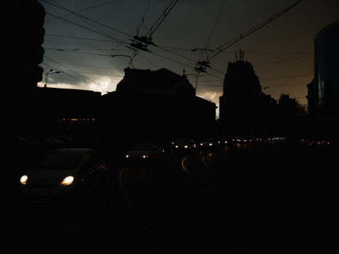

# Exclusively Dark (ExDark) Image Dataset

Updated on June 1, 2019 (added codes for low-light image enhancement using Gaussian Process)

Released on May 29, 2018

## Description

* In order to facilitate a new object detection and image enhancement research, we introduce the Exclusively Dark (ExDark) dataset [(CVIU 2019)](http://cs-chan.com/doc/cviu.pdf). The Exclusively Dark (ExDARK) dataset is a collection of 7,363 low-light images from very low-light environments to twilight (i.e 10 different conditions) with 12 object classes (as to PASCAL VOC) annotated on both image class level and local object bounding boxes. 


* Now available, codes for low-light image enhancement using Gaussian Process for features retrieval. [(SPIC 2019)](http://cs-chan.com/doc/SPIC2019.pdf)

  

## Citation
If you find this dataset useful for your research, please cite
```
@article{Exdark,
  title={Getting to Know Low-light Images with The Exclusively Dark Dataset},
  author={Loh, Yuen Peng and Chan, Chee Seng},
  journal={arXiv preprint arXiv:1805.11227},
  year={2018}
}
```

## Feedback
Suggestions and opinions of this dataset (both positive and negative) are greatly welcomed. Please contact the authors by sending an email to
`lexloh2009 at hotmail.com`or `cs.chan at um.edu.my`.

## License and Copyright
The project is open sourced under BSD-3 license (see the ``` LICENSE ``` file). Codes can be used freely only for academic purpose.
